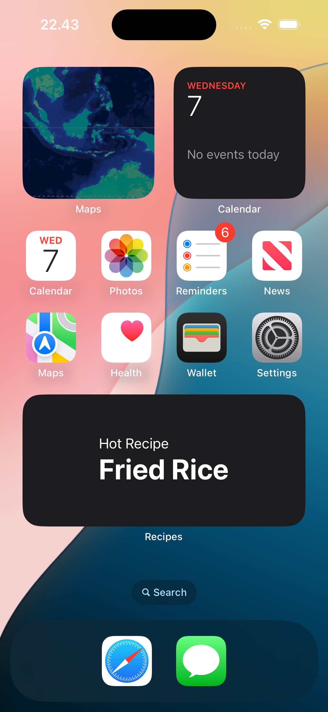
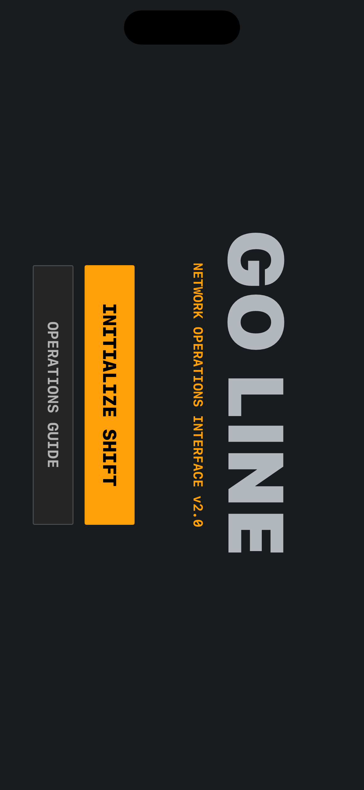

# Go Line 🧵

**Connect the City.**

Go Line is a zen transit management simulator with a minimalist paper and thread aesthetic. Draw a network of colorful transit lines to transport passengers across a textured map, managing efficiency and tension as your city grows.

## ✨ Core Identity
Go Line blends the strategic depth of transit puzzles with a clean, minimalist art style. Every line you draw is a "stitch" on the map, and every delivery contributes to the overall stability of your urban network.

## 🧵 Key Features

### 1. Progressive Network Expansion
Start with a single red line. As you complete shifts and your level increases, you'll unlock new colors (Blue, Green, Orange, Purple), allowing you to build complex, multi-line transit systems.

### 2. Day Cycle Management
Manage your network through timed daily shifts. Monitor the **Day Progress Bar** (Green) to track your shift's progress. Each successful day earns you currency and brings you closer to new unlocks.

### 3. Systematic Upgrades
Spend your earned **Thread** (Currency) in the shop to improve your fleet:
- 🚆 **Add Carriages:** Increase train capacity to handle high-traffic stations.
- ⚡ **Faster Needle:** Boost train speed to reduce passenger wait times.
- 💪 **Network Strength:** Toughen your network to handle higher tension and overcrowding levels.

### 4. Smooth Geometry
Draw curved, "stitched" paths between stations using an intuitive touch-drag interface. The game uses quadratic Bezier curves and dashed line patterns to create a clean, handcrafted look.

## 🕹️ How to Play
1. **Connect:** Drag between stations to create a transit line with your current color.
2. **Deliver:** Passengers (Geometric Shapes) spawn at stations and want to travel to a station with a matching shape.
3. **Manage Tension:** Prevent stations from overcrowding. High tension levels will eventually lead to a network failure.
4. **Advance:** Complete shifts to earn Thread, purchase upgrades, and unlock new line colors.

## 🖼️ Gallery

| Menu | Shop | Guide |
| :---: | :---: | :---: |
|  |  |  |

## 🛠️ Technical Stack
- **Engine:** SpriteKit (2D Game Engine)
- **UI:** SwiftUI (HUD, Shop, and Menus)
- **Language:** Swift 5.10
- **Architecture:** Manager-based state management
- **Visuals:** Custom GLSL Shaders for paper textures and dashed path rendering.

## 🚀 Getting Started
1. Clone the repository.
2. Open `Go Line.xcodeproj` in Xcode 15+.
3. Select a Landscape-oriented Simulator (e.g., iPhone 15 Pro).
4. Build and Run!

---
*Created for fans of minimalist strategy and transit sims.*