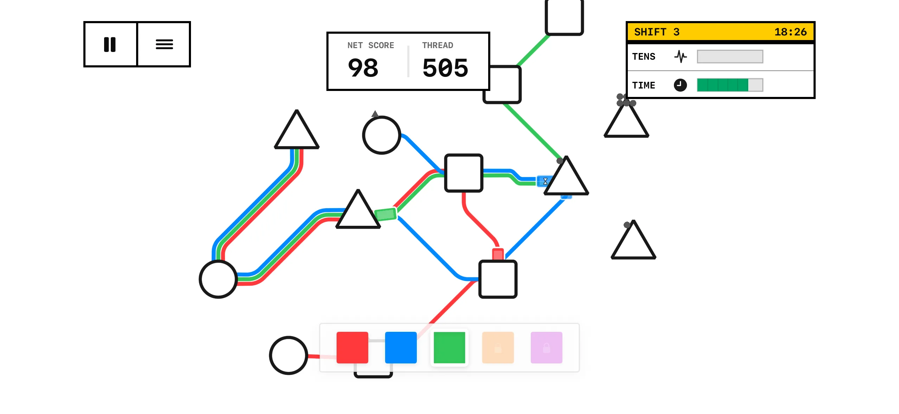
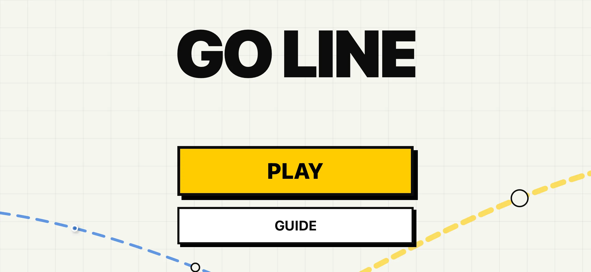
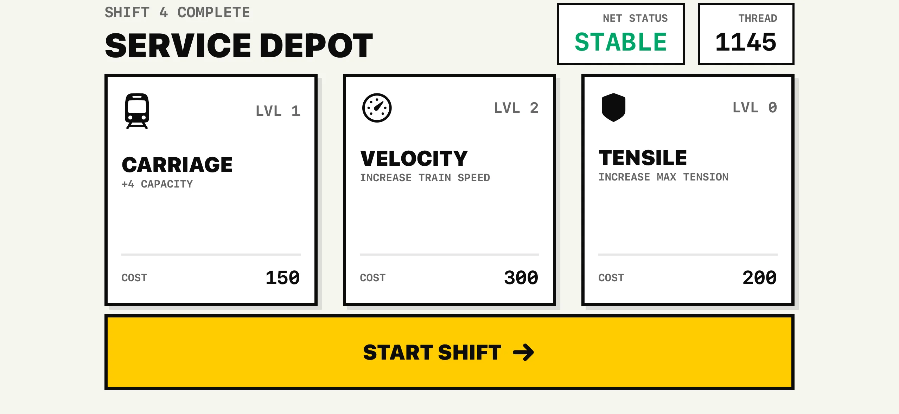

# Go Line 🧵

**Connect the City.**

Go Line is a zen transit management simulator. Draw colorful transit lines to transport passengers, managing efficiency and flow as your city grows.

## Stats

## Core Identity

Go Line is a strategic transit puzzle with a clean, industrial aesthetic. Every line you draw stitches the map together. Every delivery keeps your network stable.

## Key Features

### Progressive Network Expansion

Start with a single red line. Complete shifts to unlock new colors—Blue, Green, Orange, Purple—and build complex multi-line systems.

### Day Cycle Management

Manage your network through timed shifts. The Day Progress Bar tracks your progress. Each successful day earns currency and unlocks.

### Systematic Upgrades

Spend Thread (currency) in the shop to improve your fleet:

- 🚆 **Add Carriages:** Increase train capacity for high-traffic stations.
- ⚡ **Faster Needle:** Boost train speed to reduce wait times.
- 💪 **Network Strength:** Handle higher tension and overcrowding.

### Interactive Camera & UI

- **Industrial UI:** Metallic textures, progress bars, clean typography.
- **Pinch-to-Zoom:** Explore your network with intuitive gestures.

### Smooth Geometry

Draw curved, stitched paths between stations with touch-drag controls. Quadratic Bezier curves and dashed patterns create a clean, handcrafted look.

## How to Play

1. **Connect:** Drag between stations to create a transit line.
2. **Deliver:** Transport passengers (geometric shapes) to matching stations.
3. **Manage Tension:** Prevent overcrowding. High tension leads to network failure.
4. **Advance:** Complete shifts to earn Thread, buy upgrades, unlock colors.

## Gallery

| Menu | Shop | Gameplay |
| :---: | :---: | :---: |
|  |  |  |

## 🛠️ Technical Stack
- **Engine:** SpriteKit (2D Game Engine)
- **UI:** SwiftUI (HUD, Shop, and Menus)
- **Reactive Logic:** RxSwift / RxCocoa
- **Dependency Management:** CocoaPods
- **Language:** Swift 5.10
- **Architecture:** Reactive state management with Manager-based relays.
- **Visuals:** Custom GLSL Shaders for paper textures and dashed path rendering.

1. Clone the repository.
2. Ensure you have [CocoaPods](https://cocoapods.org/) installed (`brew install cocoapods`).
3. Run `pod install` in the project root.
4. **Important:** Open **`Go Line.xcworkspace`** in Xcode 15+.
5. Select a Landscape-oriented Simulator (e.g., iPhone 15 Pro).
6. Build and Run!

---

*For fans of minimalist strategy and transit sims.*

